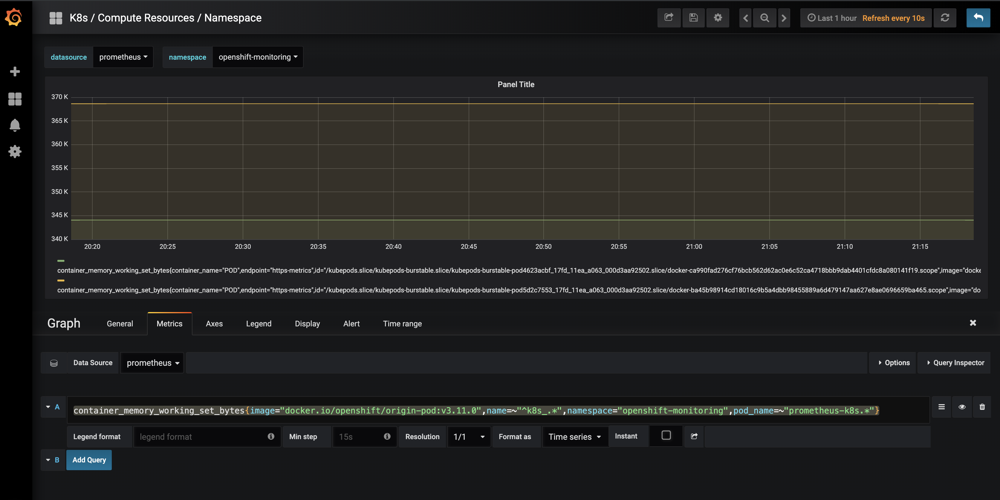

## 1: Prometheus Operator

### Rbac:
Command:
```bash 
oc get clusterrolebindings  prometheus-operator  -n openshift-monitoring  -o yaml
```
Output:
Check the output [here](manifests/prometheus-operator-cr.yaml)


## 2: Prometheus

### Prometheus Pods
To get the running pods for promethues, run the following command
Command:
```bash
oc get pods -n openshift-monitoring
```
Output:
Check the output [here](manifests/prometheus-k8s-0.yaml)

### Explaination
There are four containers running inside Prometheus POD

#### 1. Prometheus
Prometheus is systems monitoring and metric collection tool.

#### 2. prometheus-config-reloader
It is an add-on to prometheus that monitors changes in prometheus config and an HTTP request reloads the prometheus configuration

#### 3. rules-configmap-reloader
It monitors changes in the alerts file and also reloads prometheus

#### 4. Prometheus Proxy/oauth-proxy
A reverse proxy and static file server that provides authentication and authorization to an OpenShift OAuth server remote authorization endpoints to validate access to content. It is intended for use within OpenShift clusters to make it easy to run both end-user and infrastructure services that don't provide their own authentication.

Features:

- Performs zero-configuration OAuth when run as a pod in OpenShift
- Able to perform simple authorization checks against the OpenShift and Kubernetes RBAC policy engine to grant access
- On OpenShift 3.6+ clusters, supports zero-configuration end-to-end TLS via the out of the box router

### Prometheus UI
Run the command to get the prometheus dashboard endpoint
```bash
oc describe routes prometheus-k8s -n openshift-monitoring
```
OutPut:
```
Name:			prometheus-k8s
Namespace:		openshift-monitoring
Created:		28 hours ago
Labels:			<none>
Annotations:		openshift.io/host.generated=true
Requested Host:		prometheus-k8s-openshift-monitoring.cp-stakater.com
			  exposed on router router 28 hours ago
Path:			<none>
TLS Termination:	reencrypt
Insecure Policy:	<none>
Endpoint Port:		web

Service:	prometheus-k8s
Weight:		100 (100%)
Endpoints:	10.129.0.7:9091, 10.131.0.8:9091
```

Go to this url to check the Prometheus configuration
https://prometheus-k8s-openshift-monitoring.cp-stakater.com/
-> Status -> Configuration

### Prometheus Rbac
Command:
```bash
oc get roles prometheus-k8s -o yaml
```
Output:
Check the output [here](manifests/prometheus-k8s-role.yaml)

### Prometheus Custom Resource Definition (CRD)
Prometheus Operator uses the Prometheus CRD to generate prometheus objects.
To get the CRD for Prometheus
Command:
```bash
oc get crd prometheuses.monitoring.coreos.com -n openshift-monitoring -o yaml
```
Output:
Check the output [here](manifests/prometheuses-crd.yaml)

### Prometheus Custom Resource (CR)
Prometheus Operator uses the Prometheus CR to manage prometheus.
To get the CR for Prometheus
Command:
```bash
oc get prometheus k8s -n openshift-monitoring -o yaml
```
Output:
Check the output [here](manifests/prometheus-k8s-cr.yaml)

Notes:
- Alert Manager configuration is defined
- Prometheus base Image is defined
- Prometheus Proxy configuration is defined
- Replicas are defined
- Service Monitor Selector is defined

Activity:
Increase the number of replicas using the using the CR

## 3: ServiceMonitor

Servicemonitor is a CRD and Prometheus Operator uses service monitors to generate Prometheus configuration

### Service Monitor CRD:
Prometheus Operator uses the Prometheus CRD to generate prometheus objects.
To get the CRD for Prometheus
Command:
```bash
oc get crd servicemonitors.monitoring.coreos.com -n openshift-monitoring -o yaml
```
Output:
Check the output [here](manifests/servicemonitors_crd.yaml)


### Service Monitor Custom Resource Definition (CRD):
Prometheus Operator uses the Prometheus CRD to generate prometheus objects.
To get the CRD for Prometheus
Command:
```bash
oc get crd servicemonitors.monitoring.coreos.com -n openshift-monitoring -o yaml
```
Output:
Check the output [here](manifests/servicemonitors_crd.yaml)


### Service Monitor Custom Resource (CR):
Prometheus Operator uses the service monitors to generate prometheus configuration
To view all the CR for Service Monitor

Command:
```bash
oc get servicemonitors -n openshift-monitoring
```
To view a specific service monitor e.g. prometheus
Command:
```bash
oc get servicemonitors prometheus -n openshift-monitoring -o yaml
```
Output:
Check the output [here](manifests/prometheus-servicemonitors.yaml)

Note: Prometheus Operator uses the label selectors in Service monitor to know for which service the configuration is going to be generated.

## 4. Node Exporter

### Node Exporter DaemonSet

Node Exporter is deployed as a Daemonset, it means one node-exporter pod is running on every node.

To get the Daemonset for NodeExporter,
Command
```bash
oc get daemonsets node-exporter -n openshift-monitoring -o yaml
```
Output:
Check the output [here](manifests/node-exporter-ds.yaml)

#### Containers
1. node-exporter
2. kube-rbac-proxy
The kube-rbac-proxy is a small HTTP proxy for a single upstream, that can perform RBAC authorization against the Kubernetes API.

In Kubernetes clusters without NetworkPolicies any Pod can perform requests to every other Pod in the cluster. This proxy is used in order to restrict requests to only those Pods, that present a valid and RBAC authorized token or client TLS certificate.


### Node Exporter Service Monitor
To view a node-exporter service monitor,
Command:
```bash
oc get servicemonitors node-exporter -n openshift-monitoring -o yaml
```
Output:
Check the output [here](manifests/node-exporter-sm.yaml)

### Node Exporter Metrics
Node-exporter metrics are not publically accessible, so to view the raw metrics we have to ssh into the prometheus pod
Command:
```bash
oc exec -it prometheus-k8s-0 -n openshift-monitoring -c prometheus -- /bin/sh
```

Now use a Curl command to get the /metrics endpoint
```bash
KUBE_TOKEN=$(cat /var/run/secrets/kubernetes.io/serviceaccount/token)
curl -sSk -H "Authorization: Bearer $KUBE_TOKEN" https://node-exporter.openshift-monitoring.svc:9100/metrics
```

## 5. Kube state Metrics

Kube state metrics runs as deployment
Command:
```bash
oc get deployments kube-state-metrics -n openshift-monitoring -o yaml
```
Output:
Check the output [here](manifests/kube-state-metrics.yaml)

### Kube state Metrics Service Monitor
To view a Kube state Metrics service monitor,
Command:
```bash
oc get servicemonitors kube-state-metrics -n openshift-monitoring -o yaml
```
Output:
Check the output [here](manifests/kube-state-metrics-sm.yaml)

## 6. Alert Manager

### Alert Manager CRD
Prometheus Operator uses a CRD for Alert manager as well
Command:
```bash
oc get crd alertmanagers.monitoring.coreos.com -n openshift-monitoring -o yaml
```
Output:
Check the output [here](manifests/alertmanager-crd.yaml)

### Alert Manager CR

Prometheus Operator uses a CRD for Alert manager as well
Command:
```bash
oc get alertmanagers main -n openshift-monitoring -o yaml
```
Output:
Check the output [here](manifests/alertmanagers-main-cr.yaml)

### Add Custom Alert
To Add custom Alert, modify the Prometheus-Rule.yaml and add below
```yaml
    - name: Custom-Alert
      rules:
        - alert: PrometheusReplicaDown
          annotations:
            message: Prometheus Replica Count is less than 1
          expr: sum(up{namespace="openshift-monitoring",pod=~"prometheus-k8s.*"})<1
          for: 15m
          labels:
            kind: infra
            severity: critical
```
This will add a custom alert that would be triggered, when prometheus replica count becomes less than 1

## 7. Grafana

Check the Grafana Dashboard [here](https://grafana-openshift-monitoring.cp-stakater.com).
To Add a custom Panel, Press `Add Panel` button at Top left and select a Graph.
Change the datasource to `prometheus` and namespace to `openshift-monitoring`. And then add below query
```
container_memory_working_set_bytes{image="docker.io/openshift/origin-pod:v3.11.0",name=~"^k8s_.*",namespace="openshift-monitoring",pod_name=~"prometheus-k8s.*"}
```
It will show the prometheus container memory utilization for both replicas.



