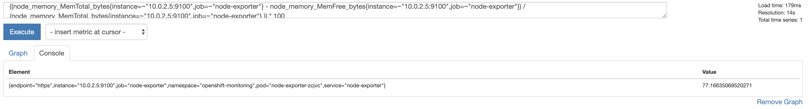
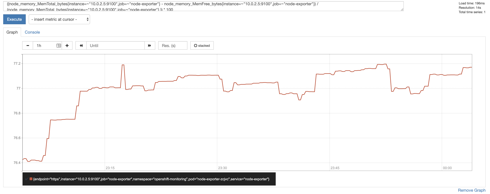
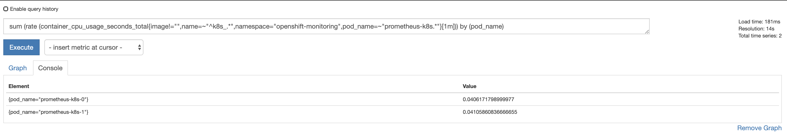
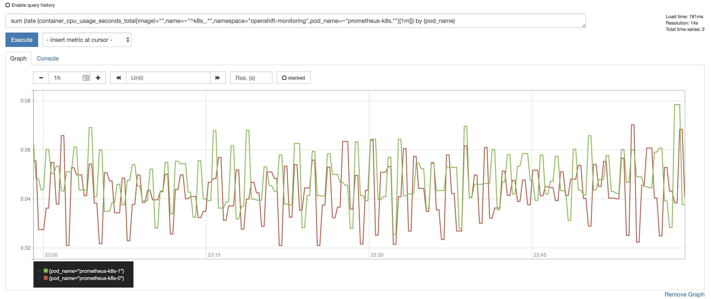
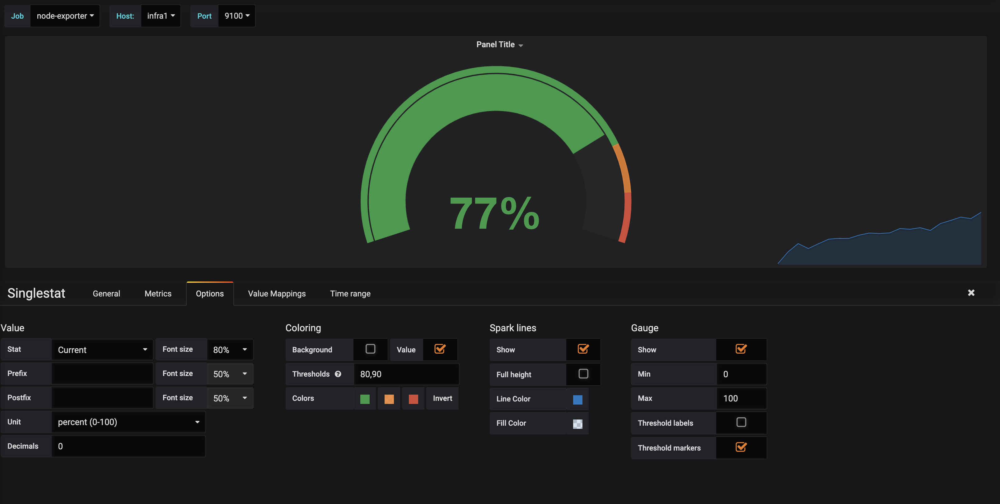
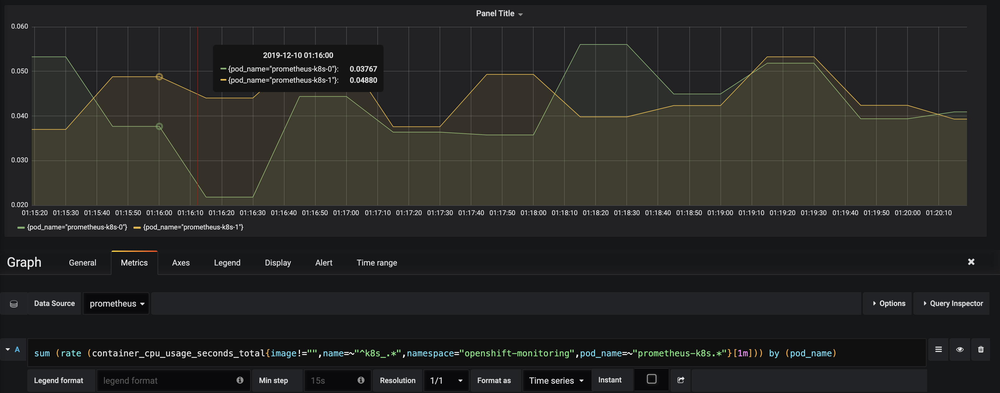
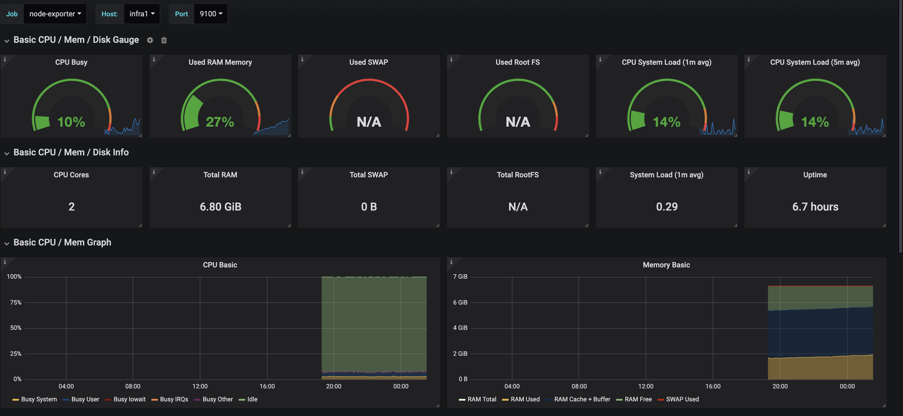

## Workshop Part 2

### Setup the repository locally
1. Clone the stakater monitoring workshop.
```bash
git clone https://github.com/stakater-lab/stakater-monitoring-workshop.git
```

2. Checkout to workshop branch
```bash
git checkout azure-openshift-workshop
```

### 2. Install Prometheus Forwarder and Influx-db to scrap and save metrics in influx db
This step will only be done once because influx-db and prometheus forwarder will be installed once.
1. Goto `infra` directory in root folder of respository.
2. Follow the commands in README.md to install the influx-db and prometheus forwarder

### Intall seperate prometheus and node-mart application for each participant

This step will be executed by each participant on their machines.

1. Go to `application` directory in root folder of respository.
2. Follow the commands in README.md to install your own instance of Prometheus and Node-mart application


### View Metrics on Prometheus

1. To view the memory usage by percentage of any node as Graph

Get the available nodes
```bash
oc get nodes
```
Get the InternalIP of that node.
```bash
oc describe node infra1 | grep InternalIP
```
Replace this ip: `10.0.2.5` in below command with the ip of node and then run this command on Prometheus.

```bash
((node_memory_MemTotal_bytes{instance=~"10.0.2.5:9100",job=~"node-exporter"} - node_memory_MemFree_bytes{instance=~"10.0.2.5:9100",job=~"node-exporter"}) / (node_memory_MemTotal_bytes{instance=~"10.0.2.5:9100",job=~"node-exporter"} )) * 100
```




2. To view the Current number of running prometheus pods in your namespace.

```bash
sum(up{namespace="openshift-monitoring",pod=~"prometheus-k8s.*"})
```

3. To view the cpu usage of Prometheus container

```bash
sum (rate (container_cpu_usage_seconds_total{image!="",name=~"^k8s_.*",namespace="openshift-monitoring",pod_name=~"prometheus-k8s.*"}[1m])) by (pod_name)
```




4. To view the custom metrics as total requests for product catalogue 

Replace the `NAMESPACE` placeholder with your own namespace
```
count_requests_total{namespace="NAMESPACE"}
```

### Create dashboards on Grafana

1. To view the memory usage by percentage of any node as Graph

    1. Create a `SingleStat` from `Add Panel` button at top right
    2. Change the datasource to `prometheus`
    3. Use the same query: 1 that we used for prometheus with the node ip and add that query
    4. Click on Options tab and change the values as shown in the below image

```bash
((node_memory_MemTotal_bytes{instance=~"10.0.2.5:9100",job=~"node-exporter"} - node_memory_MemFree_bytes{instance=~"10.0.2.5:9100",job=~"node-exporter"}) / (node_memory_MemTotal_bytes{instance=~"10.0.2.5:9100",job=~"node-exporter"} )) * 100
```



2. To view the cpu usage of Prometheus container

    1. Create a `Graph` from `Add Panel` button at top right
    2. Change the datasource to `prometheus`
    3. Use the same query: 2 that we used for prometheus with the node ip and add that query
    4. Click on Options tab and change the values as shown in the below image

```bash
sum (rate (container_cpu_usage_seconds_total{image!="",name=~"^k8s_.*",namespace="openshift-monitoring",pod_name=~"prometheus-k8s.*"}[1m])) by (pod_name)
```


3. Create your own Dashboard with the metrics from Node-exporter
    1. Copy the Json for Grafana dashboard from [here](manifests/node-exporter-full_rev15.json).
    2. Goto Grafana and click on `plus (+)` icon on the left sidebar.
    3. Select Dashboard
    4. Go to settings and paste the copied json into the json model
    5. Save the changes



### Add Custom Alert
To Add custom Alert, modify the Prometheus-Rule.yaml and add below rule under groups in Prometheus-Rule.
1. Go to [Openshift Console](https://cp-stakater.com:8443/console/project/openshift-monitoring)
2. Select Resources -> Other Resources on left Side bar
3. Type `Prometheus Rule` on drop-down and edit `prometheus-k8s-rules` file.
4. To view the alert, go to Prometheus dashboard and Click on `Alerts`, An Alert by name of `PrometheusReplicaDown` will appear after a minute.
```yaml
    - name: Custom-Alert
      rules:
        - alert: PrometheusReplicaDown
          annotations:
            message: Prometheus Replica Count is less than 1
          expr: sum(up{namespace="openshift-monitoring",pod=~"prometheus-k8s.*"})<1
          for: 15m
          labels:
            kind: infra
            severity: critical
```
This will add a custom alert that would be triggered, when prometheus replica count becomes less than 1.